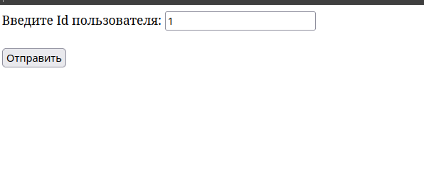

<h1>Тестовое задание на фласке</h1>

    Нужно написать небольшой микросервис на flask
    Микросервис принимает запросы в виде id После отдает в виде данных
    по этому id 

    Что нужно использовать 
    flask
    peewee
    postgresql

    Реализовать форму для поиска юзера по id в базе данных Data,
    в которой есть столбцы: id,name,age
    возвращаем в виде текста id,name,age из бд

    Для удобной работы с базой данных советуем использовать Dbeaver
    Должна быть обработка ошибок на тип данных, если не правильный тип или же
    нет такого значения возвращается 404 ошибка

<h1>Запуск</h1>
    
    Для запуска создайте виртуальное окружение
    
    linux - python3 -n venv venv
    
    активируйте его - source venv/bin/activate
    
    установите файл requirments.txt - pip install -r requirments.txt
    
    Скачайте Dbeaver установите драйве postgresql установите на него пароль 1234
    
    Перейдите в файл create_data_in_db.py запустите его
   
    Перейдите в файл app.py и запустите 

    Осуществите переход по адресу http://127.0.0.1:5000
    
    
    откроется вот это окно
    Done!
    